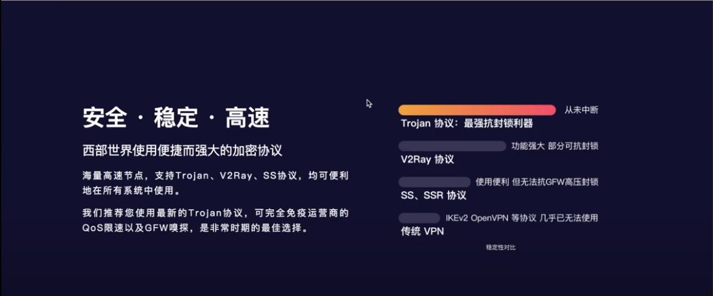
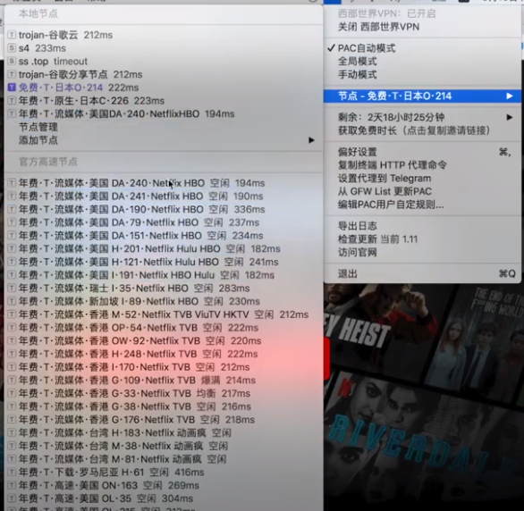
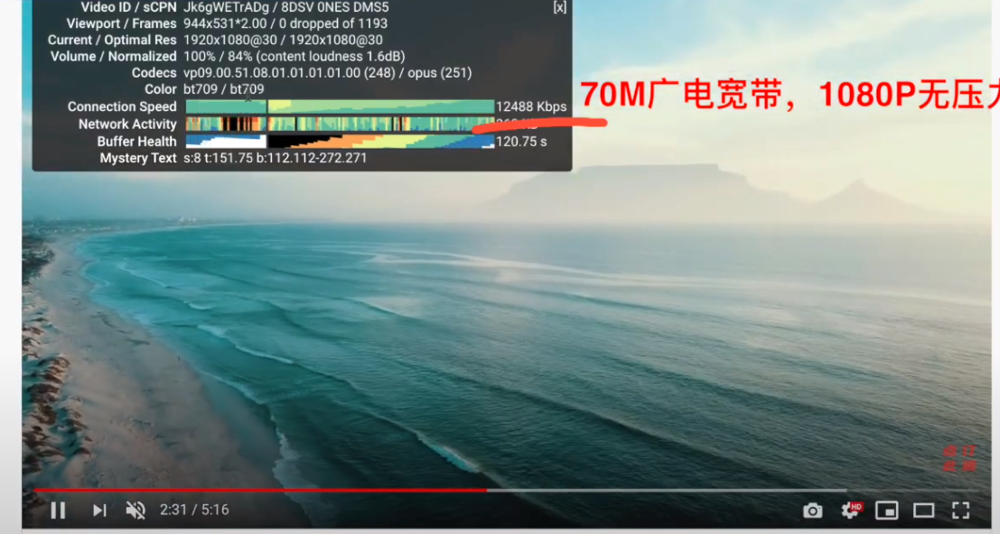
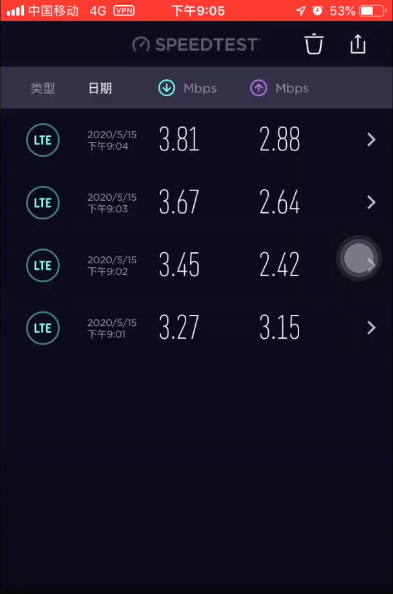
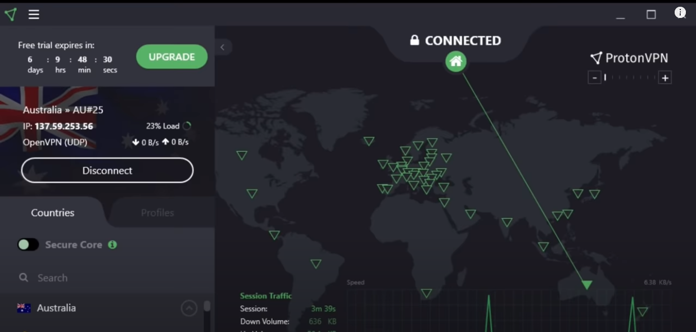
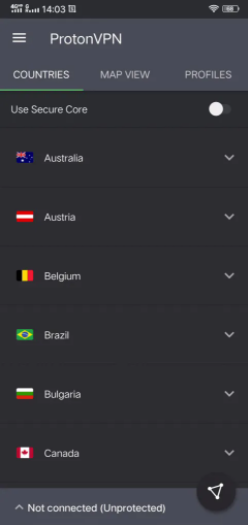

# 最新实测Top2神级好用不贵的VPN梯子工具，大牌稳定不踩雷

### 大家好这里是老白测评，本期主要和大家推荐两款在国外排名前5的神级VPN，排名主要是通过它们的稳定性，安全性和可操作性进行对比，先来看下这两款好用稳定的VPN分别是什么名字：

### No1.Westworld VPN [点击访问官网](https://xbsj3462.fun/i/art083)
### No2.ProtonVPN [点击访问官网](https://protonvpn.com/)

## 一、Westworld VPN

排名第一的就是这个Westworld VPN，Westworld 是一家位于法罗群岛的公司，在安全性以及可用性都是首屈一指的，在windows/ios/mac/Adriod/Linux等系统都有稳定的客户端，而且它的客户端还支持shadowsocks OBFS和V2ray-plugin插件。

Westworld VPN的机房位于欧洲最安全的数据中心，提供军事级别的加密，安全性首屈一指。

Westworld VPN除了拥有独立的客户端之外，它同时还是一个机场服务商。后台的流媒体节点支持看奈飞以及Hulu、HBO、动画疯、TVB、Apple TV等。

对于新用户，它支持前三天免费试用的模式，如果试用满意，可以选择包月或者包年两种套餐，包月套餐折合人民币是25一个月，包年套餐折合人民币188一个月，需要注意的是，如果你选择购买包年套餐，下单之后他还会额外赠送你一个包月的兑换码。

经过我一定信息的调查，发现西部世界这款VPN梯子是在18年底就开始提供服务了，我相信经历了这两年的洗礼，还能够坚持下来，就证明它有独特的优势。

目前后台支持的节点协议有V2ray和Trojan两种，最早期还提供ssr的服务，但是后来可能因为ssr节点被封锁太频繁，就下架了，现在线路节点都是用的IEPL专线，速度体验也是飞快。

其他就不多说了，进入大家最关心的测速阶段：

#### 广电网络70M宽带，Youtube 1080p：

#### 移动4G网络，SpeedTest测试：

大家可以结合自己的情况去选择使用。

## 二、Proton VPN

Proton VPN是一家瑞士公司，这款梯子也是通过邮箱注册的，注册之后会提供给你一个试用期。这家梯子软件是受瑞士隐私法保护的，提供无日志政策，不记录个人IP。

这款梯子软件的价格比较高，但是同样的，稳定性也比较出色，连接好之后的使用速度也是ok的，其实它最吸引我的一点，就是界面的UI设计比较酷。

登录proton之后，他会自动给你选择一条节点进行连接，连接规则就是选择于你而言速度最快的节点，当然自动选择并不是每次都能够100%连接成功，当连接失败的时候，只需要手动选择节点再次连接就可以了。

如果自动连接成功了，但是你感觉网速比较慢，也可以手动一个个连接他们的其他节点，然后选择感觉速度不错的节点进行使用。

如果你有美区的苹果ID，那么可以登录app store直接下载他们的官方客户端，使用[苹果手机vpn](http://react-china.org/t/topic/38279)，和Westwolrd VPN一样，手机上的客户端也是只要选中节点，再点击连接按钮，等到显示连接成功之后，就可以开始使用了。

使用苹果手机的时候，有一点需要注意，就是当你的手机不小心进入锁屏状态，解锁之后，你需要重新启动app客户端，重新选择节点进行连接后才能继续使用，因为锁屏会导致软件进入休眠。

### 这两款梯子VPN都是经过时间和大量用户的考验，在国外很受欢迎的翻墙软件，所以如果你需要一款安全稳定可靠，同时能够有效保护用户隐私数据的VPN梯子，那么从这两款中选择一款就可以了。
